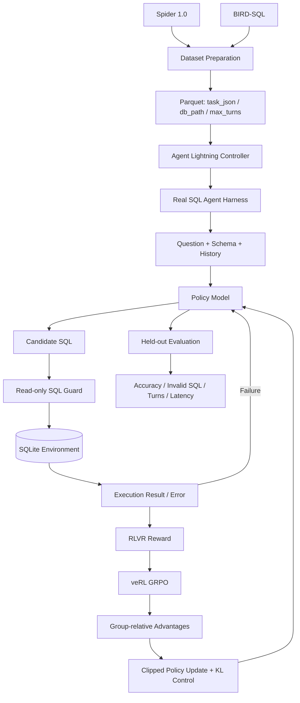

<div align="center">

# 大模型在线强化学习与策略优化

**GRPO · RLVR · On-Policy RL · Agent Lightning · veRL**

让模型不再只模仿标准答案，而是通过**真实执行、可验证奖励和在线策略更新**学会完成任务与纠正错误。

[](https://github.com/Benjamindaoson/Agentic-RL/actions/workflows/ci.yml)

</div>

---

## 项目解决什么问题

监督微调可以教会模型“这个问题对应哪条 SQL”，但无法直接教会模型：

- SQL 执行失败后如何根据错误信息修改；
- 查询可以执行但结果错误时，如何重新检查连接、过滤和聚合；
- 面对未见过的表结构时，如何利用真实环境反馈改善策略；
- 如何在准确率、重试次数、延迟和 GPU 成本之间做合理取舍。

本项目把 Text-to-SQL 变成一个可交互的强化学习环境：

```text
问题 + Schema
      ↓
模型生成 SQL
      ↓
只读数据库真实执行
      ↓
执行结果 / 错误反馈
      ↓
可验证奖励
      ↓
GRPO 组内优势估计与策略更新
      ↓
更新后的模型重新 Rollout
```

项目的贡献重点是**强化学习算法与实验设计**，而不是 Agent 应用编排。SQL Agent 只作为具备真实环境、客观奖励和多轮纠错能力的实验载体。

---

## 核心实验结果

以 **Qwen2.5-Coder-3B-Instruct** 为策略模型，在 Spider 1.0 可执行 SQL 环境中进行 GRPO 训练：

| 设置 | 训练前 | GRPO 后 | 提升 | 企业价值 |
|---|---:|---:|---:|---|
| 4096 上下文，单轮 | 68.8% | **80.2%** | **+11.4pp** | 小模型在一次决策内完成更多正确任务，减少工具调用与响应延迟 |
| 4096 上下文，三轮 | 69.6% | **80.4%** | **+10.8pp** | 在线强化学习显著提升最终任务成功率，使低成本专用模型更接近可用水平 |

### 上下文、轮次与显式检查的投入产出

| 对照 | 变化 | 结论 |
|---|---:|---|
| 单轮：2048 → 4096 上下文 | 73.2% → **80.2%（+7.0pp）** | 完整保留 Schema 与执行反馈，比单纯增加重试更有效 |
| 三轮：2048 → 4096 上下文 | 76.4% → **80.4%（+4.0pp）** | 长上下文提高多轮纠错中的信息连续性 |
| 4096 上下文：1 轮 → 3 轮 | 80.2% → **80.4%（+0.2pp）** | 额外两轮交互收益极低，不足以覆盖新增延迟与推理成本 |
| 2048 上下文：无检查 → 显式检查 | 76.4% → **77.6%（+1.2pp）** | 自检有收益，但训练时间接近翻倍，应按业务成本选择 |

实验快照保存在 [`reports/benchmark_snapshot.md`](reports/benchmark_snapshot.md)。仓库同时提供完整的数据接入、训练、Rollout 和评测代码，用于重新生成实际运行结果。

---

## 为什么选择 SQL 作为 RLVR 环境

SQL 任务同时具备四个条件：

1. **动作可执行**：模型输出可以直接在数据库中运行；
2. **结果可验证**：预测 SQL 与标准 SQL 可以通过执行结果比较；
3. **失败可反馈**：语法错误、字段不存在、结果不匹配都能形成环境信号；
4. **轨迹可延长**：模型可以执行“生成 → 失败 → 修正 → 再执行”的多步策略。

相比只使用 AI Judge 给回答打分，执行结果奖励具有更低的主观性，也更容易发现 Reward Hacking。

---

## 强化学习定义

| RL 元素 | 本项目定义 |
|---|---|
| **Observation** | 用户问题、数据库 Schema、外部证据、历史 SQL、执行结果、错误信息、剩余轮次 |
| **Action** | 生成或重写一条只读 SQL |
| **Environment** | Spider / BIRD 的真实 SQLite 数据库 |
| **Reward** | 执行结果是否与标准查询等价，并附加无效、危险、超时和重试成本 |
| **Policy** | Qwen2.5-Coder-3B-Instruct |
| **Trajectory** | 多轮模型调用、SQL、执行结果、反馈、最终奖励 |
| **Optimization** | GRPO On-Policy 策略更新 |

---

## 开源数据集

### Spider 1.0：主训练与同分布评测

Spider 1.0 包含：

- **10,181** 个自然语言问题；
- **5,693** 个唯一复杂 SQL；
- **200** 个多表数据库；
- **138** 个领域；
- 训练与测试使用不同数据库 Schema，适合验证跨 Schema 泛化。

```bash
python scripts/download_spider.py --output-dir data/raw/spider
python scripts/prepare_spider.py \
  --spider-root data/raw/spider \
  --output-dir data/spider
```

准备脚本会自动生成：

```text
train_ctx2048_turn1.parquet
train_ctx2048_turn3.parquet
train_ctx2048_turn3_check.parquet
train_ctx4096_turn1.parquet
train_ctx4096_turn3.parquet

val_ctx2048_turn1.parquet
val_ctx2048_turn3.parquet
val_ctx2048_turn3_check.parquet
val_ctx4096_turn1.parquet
val_ctx4096_turn3.parquet
```

### BIRD-SQL：外部泛化评测

仓库接入：

- `birdsql/bird23-train-filtered`：**6,601** 条质量筛选后的训练数据；
- BIRD Mini-Dev：用于独立于 Spider 的外部评测；
- BIRD 真实数据库内容，用于测试外部知识、脏数据和复杂值匹配。

```bash
python scripts/download_bird.py --output-dir data/raw/bird

python scripts/prepare_bird.py \
  --records data/raw/bird/bird23_train_filtered.jsonl \
  --db-root /data/bird/train_databases \
  --output data/bird/train.parquet \
  --split train
```

BIRD 数据库体积较大，数据库文件需按官方说明下载；仓库自动处理公开元数据、任务格式和本地数据库路径绑定。

---

## 系统架构



运行模块与训练模块解耦：

- **运行侧**：真实数据库交互、轨迹记录、奖励计算；
- **训练侧**：并行 Rollout、组内优势估计、策略参数更新；
- **Agent Lightning**：把真实 Agent Harness 接入 veRL；
- **veRL**：负责 GRPO、FSDP、vLLM Rollout 和分布式训练。

---

## 可验证奖励与 Reward Hacking 防护

### 奖励组成

```text
执行结果正确      +0.90
SQL 可解析         +0.03
SQL 可执行         +0.07
危险 SQL           -1.00
无效 SQL           -0.20
执行超时           -0.15
每次额外重试       -0.02
```

核心约束：**只有执行结果正确的轨迹才能获得 0.5 以上奖励。**

因此模型无法通过以下捷径获得高分：

- 只生成语法合法、但答案错误的 SQL；
- 通过返回大量结果提高“命中”概率；
- 反复重试而不真正改善策略；
- 使用写操作、PRAGMA 或多语句查询操纵环境。

### 执行安全

- 仅允许单条 `SELECT` / `WITH`；
- 拦截 `INSERT / UPDATE / DELETE / CREATE / DROP / ALTER / PRAGMA / ATTACH`；
- SQLite 使用只读 URI 和 `query_only=ON`；
- 查询设置超时和最大结果行数；
- 截断结果不计为执行匹配；
- 无 `ORDER BY` 时按多重集合比较结果，有 `ORDER BY` 时保留顺序；
- Gold SQL 无法执行时拒绝该训练任务。

详细设计见 [`docs/REWARD_DESIGN.md`](docs/REWARD_DESIGN.md)。

---

## GRPO 实现

每个问题采样一组候选轨迹，组内奖励标准化为相对优势：

```text
A_i = (r_i - mean(r_group)) / (std(r_group) + epsilon)
```

策略使用裁剪目标更新：

```text
ratio = exp(logπ_new - logπ_old)
objective = min(ratio × A, clip(ratio) × A)
```

仓库提供：

- `group_relative_advantages`；
- clipped GRPO objective；
- response mask；
- reference KL control；
- clip fraction 和 probability ratio 监控。

生产训练由 veRL 实现，`src/agentic_rl_sql/grpo.py` 提供可测试的算法核心，用于验证优势归一化和裁剪目标。

---

## 多轮自我纠错

### 默认流程

```text
Turn 1: Question + Schema → SQL → Execute
                    ↓ wrong/error
Turn 2: Previous SQL + Execution Feedback → Rewrite → Execute
                    ↓ wrong/error
Turn 3: Updated Feedback → Rewrite → Execute
```

模型看不到 Gold SQL，只能看到：

- SQL 语法或执行错误；
- 返回列、行数和少量结果预览；
- “结果与预期不一致”的环境反馈。

### 显式检查消融

`explicit_check=true` 会在失败后额外调用 verifier，让模型先诊断查询错误，再进入重写。该机制提高准确率，但增加训练和推理调用，因此单独作为消融，而不是默认开启。

---

## 仓库结构

```text
.
├── agent/
│   └── sql_agent_entrypoint.py       # Agent Lightning 运行入口
├── configs/
│   ├── experiment_matrix.yaml
│   └── reward.yaml
├── docs/
│   ├── ARCHITECTURE.md
│   ├── DATASETS.md
│   ├── EXPERIMENTS.md
│   └── REWARD_DESIGN.md
├── reports/
│   ├── benchmark_snapshot.json
│   └── benchmark_snapshot.md
├── scripts/
│   ├── download_spider.py
│   ├── download_bird.py
│   ├── prepare_spider.py
│   ├── prepare_bird.py
│   ├── build_toy_data.py
│   ├── train_sql_agent.py
│   ├── run_local_training.sh
│   ├── launch_ablation_matrix.sh
│   ├── start_policy_server.sh
│   ├── run_rollouts.py
│   ├── compare_experiments.py
│   └── build_report.py
├── src/agentic_rl_sql/
│   ├── agent.py                       # 多轮 SQL 策略与纠错循环
│   ├── db.py                          # Schema 与只读连接
│   ├── execution.py                   # 执行与结果等价判断
│   ├── grpo.py                        # GRPO 算法核心
│   ├── reward.py                      # RLVR 奖励
│   ├── sql_guard.py                   # SQL 安全策略
│   └── trajectory.py                  # 轨迹持久化
├── tests/
├── .github/workflows/ci.yml
├── pyproject.toml
└── README.md
```

---

## 快速开始

### 环境要求

- Ubuntu 22.04+
- Python **3.12**
- CUDA 与 PyTorch 版本匹配
- Agent Lightning **1.0.x**
- veRL **0.7.1–0.8.x**
- vLLM

### 安装核心代码

```bash
git clone https://github.com/Benjamindaoson/Agentic-RL.git
cd Agentic-RL

python -m venv .venv
source .venv/bin/activate
pip install -e '.[dev]'
```

Agent Lightning + veRL 的 GPU 依赖与 CUDA 强相关。生产训练建议按照 Agent Lightning 官方安装脚本配置匹配版本，再执行：

```bash
pip install -e '.[train]'
python scripts/preflight.py --require-gpus 1
```

### CPU 冒烟测试

```bash
python scripts/build_toy_data.py --output-dir data/toy
pytest
```

---

## 训练

### 单个主实验

```bash
export MODEL=Qwen/Qwen2.5-Coder-3B-Instruct
export TRAIN_FILE=$PWD/data/spider/train_ctx4096_turn3.parquet
export VAL_FILE=$PWD/data/spider/val_ctx4096_turn3.parquet
export RUN_NAME=qwen25_coder_3b_ctx4096_turn3

bash scripts/run_local_training.sh
```

该脚本会：

1. 启动 Ray；
2. 启动 `agl-server`；
3. 启动本地 `agl-controller`；
4. 将真实 SQL Agent Harness 接入模型代理；
5. 启动 veRL GRPO 训练；
6. 在退出时清理训练服务。

### 完整消融矩阵

```bash
DATA_DIR=$PWD/data/spider \
MODEL=Qwen/Qwen2.5-Coder-3B-Instruct \
bash scripts/launch_ablation_matrix.sh
```

实验矩阵：

```text
2048 context × 1 turn
2048 context × 3 turns
2048 context × 3 turns + explicit checker
4096 context × 1 turn
4096 context × 3 turns
```

### 关键训练参数

```text
GRPO group size                 4
Train batch size               32
PPO mini-batch                 32
PPO micro-batch / GPU          4
Learning rate                  1e-6
Clip low / high                0.2 / 0.3
Reference KL coefficient       0.001
Rollout engine                 vLLM
FSDP parameter offload         enabled
FSDP optimizer offload         enabled
```

---

## 离线评测

启动基础模型或训练后策略：

```bash
export POLICY_MODEL=Qwen/Qwen2.5-Coder-3B-Instruct
export POLICY_PORT=8000
export MAX_MODEL_LEN=4096
bash scripts/start_policy_server.sh
```

运行真实数据库 Rollout：

```bash
python scripts/run_rollouts.py \
  --dataset data/spider/val_ctx4096_turn3.parquet \
  --base-url http://127.0.0.1:8000/v1 \
  --model sql-policy \
  --output runs/base_ctx4096_turn3/trajectories.jsonl
```

输出指标：

- 最终任务准确率；
- 首轮准确率；
- 平均奖励；
- 平均修正轮次；
- 无效 SQL 率；
- 危险 SQL 率；
- 平均与 P95 延迟；
- 错误类型分布。

对比实验：

```bash
python scripts/compare_experiments.py \
  --experiment base=runs/base/trajectories_metrics.json \
  --experiment grpo=runs/grpo/trajectories_metrics.json \
  --output-dir runs/comparison
```

---

## CI 与测试

```bash
pytest
python -m compileall -q src agent scripts
bash -n scripts/*.sh
```

测试覆盖：

- 只读 SQL 安全门禁；
- 多语句和写操作阻断；
- SQLite 真实执行；
- 有序/无序结果等价；
- Reward Hacking 约束；
- GRPO 组内优势；
- GRPO 裁剪目标与梯度；
- Parquet 任务格式；
- 执行失败后的多轮纠错；
- 显式检查消融路径。

---

## 复现边界

仓库包含完整算法、环境、数据接入、训练和评测代码，但不提交：

- Spider / BIRD 数据库文件；
- 模型权重与 Checkpoint；
- Ray、vLLM 或 W&B 运行产物；
- API Key；
- GPU 训练日志。

`reports/benchmark_snapshot.*` 记录项目给定实验快照。新的公开结果应通过本仓库脚本在目标 GPU 环境重新运行并保留对应轨迹、配置和评测产物。

---

## 数据集与框架

- Spider 1.0 — CC BY-SA 4.0
- BIRD-SQL — CC BY-SA 4.0
- Agent Lightning — MIT
- veRL — Apache-2.0

使用数据集和框架时，请遵循各自许可证并引用原始论文。

---

## License

Apache-2.0
